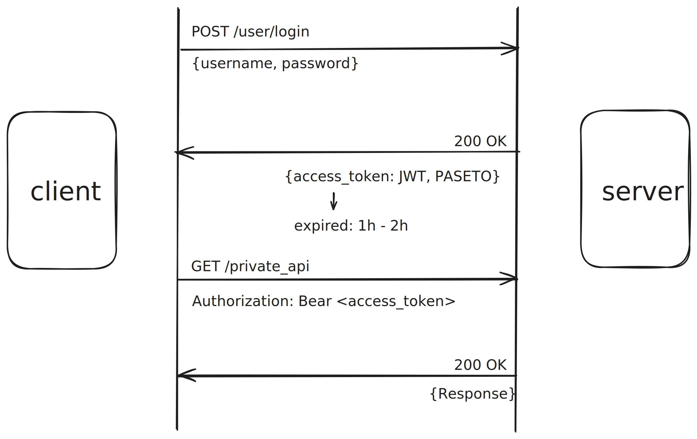
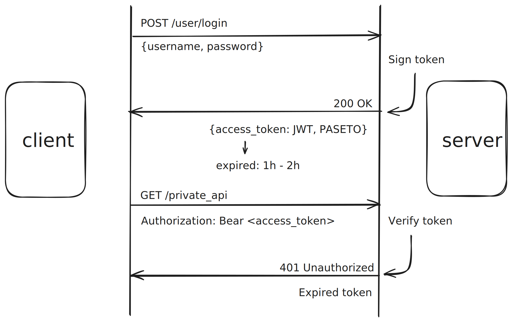
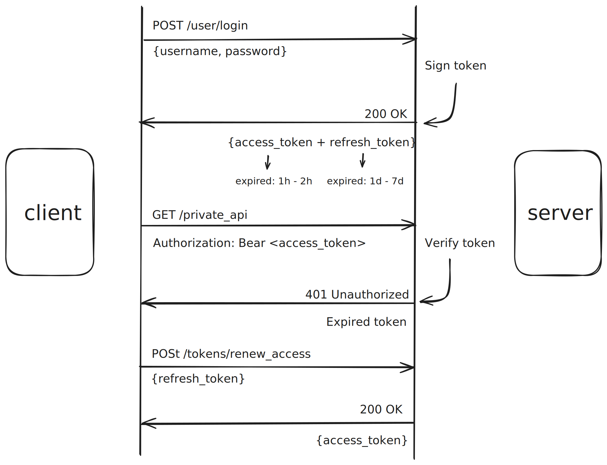

# Authtication

## Token-based Authtication

基于 Token 的身份验证由两部分组成，一部分是 access_token，API。access_token 是在登录成功之后返回的 token。当我们需要访问私有 API 时，则必须在请求头的授权字段添加 access_token，当 token 认证成功之后，才可以成功访问私有 API。




就比如登录的时候，向公开 API /users/login 发送 POST 请求，登录成功之后，服务器端就会返回 access_token，access_token 可以是 JWT 也可以是 PASETO。那么我们去访问私有 API  的时候，就需要在请求头的 授权字段带上 access_token，当该 token 被验证为是一个合法的未过期的字段时，才能成功访问私有 API。

出于安全考虑，access_token 的过期时间通常是比较短的，比如 1h-2h，当 access_token 过期后，使用过期的 access_token 访问私有 API 一般会收到服务器端 401 未授权的响应。那么客户端这边就需要重新登录，但是这样客户端就需要频繁登录，影响用户体验。



为了避免用户频繁登录，那么额外加入 refresh_token 就是很好的选择。refresh_token 并不会直接用于私有 API 的访问，而是用于在 access_token 失效之后申请新 access_token。refresh_token 一般会保存在数据库中，拥有较长的生命周期，并且可以增加 is_blocked 字段，使 refresh_token 更新为不可用的状态。refresh token 的工作原理就是客户端得知 access_token 失效之后，向专门用于更新 access_token 的路由（比如 /tokens/renew_access）发送携带 refresh_token 的 POST 请求，服务器验证 refresh_token 的合法性之后，生成新的 access_token 返回客户端。



## Token 实现

### JWT Token

设计 Maker 接口，通过实现此接口实现 JWT Make 和 PASETO Token Maker。

```GO
type Maker interface {
  CreateToken(username string, duration time.Duration) (string, *Payload, error)
  VerifyToken(token string) (*Payload, error)
}
```

JWT token 需要密钥来对 JWT 进行签名，所以先定义含有密钥字段的 JWT 对象。

```go
type JWTToken struct {
  secretKey string
}
```

NewJWTMaker 用于创建 JWTToken 对象，因为 JWTToken 会实现 CreateToken 和 VerifyToken 两个方法，所以 NewJWTToken 可以声明返回 Maker 对象，但实际上是返回 JWTToken。

```go
func NewJWTMaker(secretKey string) (Maker, error) {
	if len(secretKye) < minSecretKeySize {
		return nil, fmt.Errorf(invalid key size: must be at least %d characters", minSecretKeySize)
	}
	return &JWTToken{secretKey}, nil
}
```

CreateToken 的 JWTToken 实现：

```go
func(maker *JWTToken) CreateToken(username string, duration time.Duration) (string, *Payload, error) {
  payload := NewPayload(username, duration)

  jwtToken := NewWithClaims(jwt.SigningMethodHS256, payload)
  token, err := jwtToken.SignedString([]byte(maker.secretKey))
  return token, payload, err
}
```

1. 创建 payload；

   ```go
   type Payload struct {
   	ID        uuid.UUID `json:"id"`
   	UserAccount  string    `json:"user_account"`
   	IssuedAt  time.Time `json:"issued_at"`
   	ExpiredAt time.Time `json:"expired_at"`
   }
   
   // NewPayload 将返回新的 token Payload
   func NewPayload(userAccount string, duration time.Duration) *Payload {
   	tokenID := uuid.New()
   
   	payload := &Payload{
   		ID:        tokenID,
   		UserAccount:  userAccount,
   		IssuedAt:  time.Now(),
   		ExpiredAt: time.Now().Add(duration),
   	}
   
   	return payload
   }
   
   // Valid 用于检查 token payload 的是否有效
   func (payload *Payload) Valid() error {
   	if time.Now().After(payload.ExpiredAt) {
   		return ErrExpiredToken
   	}
   	return nil
   }
   ```

   ​	Payload 实现了 Claim 接口，所以 Payload 可以作为 Claim 类型:

   ```go
   type Claims interface {
   	Valid() error
   }
   ```

2. 创建 token 对象：

   ```go
   func NewWithClaims(method SigningMethod, claims Claims) *Token {
   	return &Token{
   		Header: map[string]interface{}{
   			"typ": "JWT",
   			"alg": method.Alg(),
   		},
   		Claims: claims,
   		Method: method,
   	}
   }
   ```

   ​	注意： token 对象的结构不代表最终返回 token 的结构。

3. 编码签名与组装：

   ```
   func (t *Token) SignedString(key interface{}) (string, error) {
   	var sig, sstr string
   	var err error
   	if sstr, err = t.SigningString(); err != nil {
   		return "", err
   	}
   	if sig, err = t.Method.Sign(sstr, key); err != nil {
   		return "", err
   	}
   	return strings.Join([]string{sstr, sig}, "."), nil
   }
   ```

   ​	t.SigningString():

   1. 将 token 中的 Header 转 JSON 格式并使用 Base64Url 编码;

   2. 将 token 中的 Claim 转 JSON 格式并使用 Base64Url 编码;

   3. 将 a 字符串和 b 字符串使用 .  连接在一起。

      ```go
      func (t *Token) SigningString() (string, error) {
      	var err error
      	parts := make([]string, 2)
      	for i, _ := range parts {
      		var jsonValue []byte
      		if i == 0 {
      			if jsonValue, err = json.Marshal(t.Header); err != nil {
      				return "", err
      			}
      		} else {
      			if jsonValue, err = json.Marshal(t.Claims); err != nil {
      				return "", err
      			}
      		}
      
      		parts[i] = EncodeSegment(jsonValue)
      	}
      	return strings.Join(parts, "."), nil
      }
      ```

   ​      t.Method.Sign(sstr, key): 使用指定的签名算法结合密钥对 SigningString() 的结果进行签名。

   ​      strings.Join([]string{sstr, sig}, ".") 将 sstr 和签名使用 . 连接在一起。

VerifyToken 的 JWTToken 实现：

```go
func (maker *JWTToken) VerifyToken(token string) (*Payload, error) { 
  keyfunc := func(token *jwt.Token)(interface{}, error) {
    _, ok := token.Method.(*jwt.SigningMethedHMAC)
    if !ok {
      return nil, ErrInvalidToken
    }
    return []byte(maker.secreKey), nil
  }
  
  jwtToken, err := jwt.ParseWithClaim(token, &Payload{}, keyfunc)
  if err != nil {
    verr, ok := err.(*jwt.ValidationError) {
      if ok && error.Is(verr.Inner, ErrExpiredToken) {
        return nil, ErrExpiredToken
      }
      return nil, ErrInvalidToken
    }
    
    payload, ok := jwtToken.Claim.(*Payload)
    if !ok {
      return nil, ErrInvalidToken
    }
    
    return payload, nil
  }
}
```

1. 创建 keyfunc 判断 token 的签名算法是否为 HMAC，并返回 secreKey 用于取出被签名的内容；
2. 判断 token 是否有效，包括是否在有效期内，是否为有效 token；
3. 解析 payload。

##### Paseto Token

Paseto 对象需要额外添加 paseto 版本对象：

```Go
type PasetoMaker struct {	
	paseto *paseto.V2
	symmetricKey []byte
}
```

NewPasetoMaker 创建 Paseto 对象：

```go
func NewPasetoMaker(symmertricKey string) (Maker, error) {
	if len(symmertricKey) != chacha20poly1305.KeySize {
		return nil, fmt.Errorf("invalid key size : must be exactly %d characters", chacha20poly1305.KeySize)
	}

	maker := &PasetoMaker{
		paseto: paseto.NewV2(),
		symmetricKey: []byte(symmertricKey),
	}

	return maker, nil
}
```

CreateToken:

```go
func (maker *PasetoMaker) CreateToken(userAccount string, duration time.Duration) (string, *Payload, error) {
	payload := NewPayload(userAccount, duration)

	token, err := maker.paseto.Encrypt(maker.symmetricKey, payload, nil)
	return token, payload, err
}
```

	1. 创建 payload；
	1. Encrypt 即可返回 token；

VerifyToken：

```go
func (maker *PasetoMaker) VerifyToken(token string) (*Payload, error) {
	payload := &Payload{}

	err := maker.paseto.Decrypt(token, maker.symmetricKey, payload, nil)
	if err != nil {
		return nil, ErrInvalidToken
	}

	err = payload.Valid()
	if err != nil {
		return nil, err
	}

	return payload, nil
}
```

	1. Decrypt 取出 payload；
	1. 验证 payload 有效性；

#### JWT 和 PASETO 如何选择？

JWT 使用 HS256 可以确保高性能。
PASETO 可以使用 chacha20poly1305 提供高安全性。
