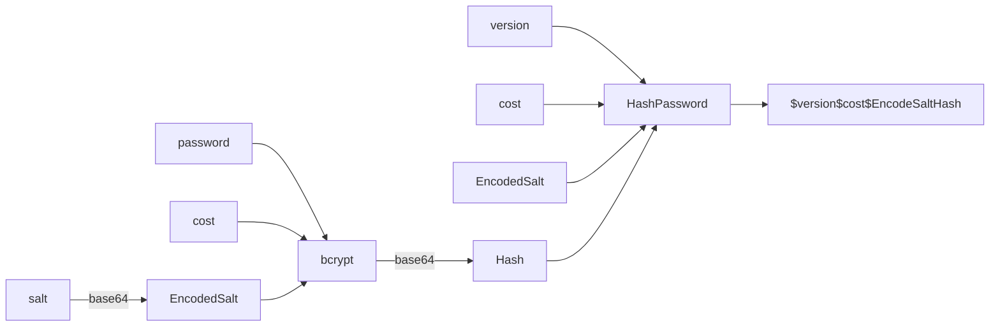
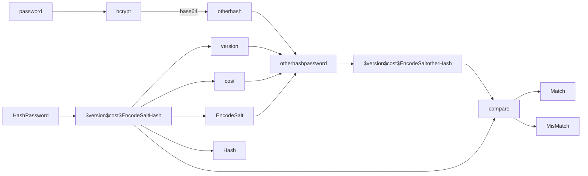

# password

本项目的密码使用 bcrypt 算法加密，bcrypt 是密码哈希算法，通过哈希避免逆向，通过加盐避免彩虹表攻击，通过工作因子降低 hash 速度来避免特殊设备的高速暴力破解。本项目使用的是 "golang.org/x/crypto/bcrypt" 提供的 bcrypt 算法，其哈希密码与验证密码的工作流程如下：


哈希密码：


验证密码：


​
代码实现如下：

```go
// HashPassword 返回 bcrpt 算法加密的密码 hash
func HashPassword(password string) (string, error) {
	hashedPassword, err := bcrypt.GenerateFromPassword([]byte(password), bcrypt.DefaultCost)
	if err != nil {
		return "", fmt.Errorf("failed to hash password: %w", err)
	}	
	return string(hashedPassword), nil
}

// CheckPasswordHash 检查密码是否匹配
func CheckPasswordHash(password, hashedPassword string) error {
	return bcrypt.CompareHashAndPassword([]byte(hashedPassword), []byte(password))
}
```

更详细信息可参考如下资料：

[bcrypt.go](https://cs.opensource.google/go/x/crypto/+/master:bcrypt/bcrypt.go)

[bcrypt](https://www.usenix.org/legacy/event/usenix99/provos/provos.pdf)